# Лабараторные работы по СМПР
# Иванча Николай

<ol><a name="content"></a>
  <li>
    <a href="#Metric">Метрические алгоритмы</a>
    <ul>
      <li><a href="#kNN">Алгоритм ближайших соседей kNN</a></li>
      <li><a href="#kwNN">Алгоритм классификации kwNN</a></li>
      <li><a href="#parsen">Парзеновское окно</a></li>
      <li><a href="#potential">Потенциальные функции</a></li>
    </ul>
  </li>
  <li>
    <a href="#Bayes">Байесовские классификаторы</a>
    <ul>
      <li><a href="#levels">Линии уровня нормального распределения</a></li>
      <li><a href="#naive">Наивный байесовский классификатор</a></li>
      <li><a href="#plug-in">Plug-in</a></li>
      <li><a href="#LDF">Линейный дискриминант фишера</a></li>
    </ul>
  </li>
</ol>

## Метрические алгоритмы
<center>
<table>
  <tbody>
    <tr>
      <th>Метод</th>
      <th>Параметры</th>
      <th>Точность</th>
    </tr>
    <tr>
	<td><a href="#kNN">kNN</a></td>
      <td>k=6</td>
      <td>0.0333</td>
    </tr>
    <tr>
      <td><a href="#kwNN">kwNN</a></td>
      <td>k=19, q=0.8</td>
      <td>0.04</td>
    </tr>  
    <tr>
      <td><a href="#parsen">Парзеновское окно</a>, Прямоугольное</td>
      <td>h=0.35</td>
      <td>0.04</td>
    </tr>
    <tr>
      <td><a href="#parsen">Парзеновское окно</a>, Треугольное</td>
      <td>h=0.35</td>
      <td>0.04</td>
    </tr>
    <tr>
      <td><a href="#parsen">Парзеновское окно</a>, Квартическое</td>
      <td>h=0.35</td>
      <td>0.04</td>
    </tr>
    <tr>
      <td><a href="#parsen">Парзеновское окно</a>, Епанечниково</td>
      <td>h=0.35</td>
      <td>0.04</td>
    </tr>
    <tr>
      <td><a href="#parsen">Парзеновское окно</a>, Гаусовское</td>
      <td>h=0.1</td>
      <td>0.04</td>
    </tr>
    <tr>
      <td><a href="#potential">Потенциальные функции</a>, Гаусовское</td>
      <td>h=1(50),h=0.5(100) </td>
      <td>Переменная</td>
    </tr>
  </tbody>
   </table>
	
	
### <a name="kNN"></a>Алгоритм ближайших соседей kNN
**Алгоритм ближайших соседей kNN** - это метрический алгоритм классификации, для реализации которого необходимо последовательно выполнить следующие операции:
* Посчитать расстояние до каждого из объектов обучающей выборки
* Отсортировать выборку в порядке близости к классифицируемому объекту
* Выбрать k  первых элементов(k ближайших соседей)
* Классом классифицируемого объекта будет являться тот клас, который чаще всего встречается среди k ближайших соседей

|Карта классификации kNN|
|-------------------|
||

В качестве обучающей выборке был взят набор "Ирисы Фишера", а в качестве функции расстояния было использованно Евклидово расстояние

``` R
distance <- function(u, v)
{
	sqrt(sum((u - v)^2))
}
```
Для более точного процесса классификации необходимо правильно подобрать параметр k. Воспользуемся критерием скользящего контроля по отдельным объектам - **LOO**(leave-one-out). Суть данного критерия в разделении обучающей выборки на подвыборку для тренировки и один элемент для контроля. Преимущество LOO в том, что каждый объект ровно один раз участвует в контроле, а длина обучающих подвыборок лишь на единицу меньше длины полной выборки.


Если алгоритм классификации при данном k неправильно определяет класс классифицируемого объекта, то оценка для этого k ухудшается. Оптимальным считается тот k, оценка которого наилучшая.

Оценка скользящего контроля LOO алгоритма k-ближайших соседей для данного набора показала, что классификация более точна при k=6.

График оценки скользящего контроля, а также карта классификации выглядят следующим образом:

LOO(k) алгоритма kNN|Карта классификации kNN, при k = 6
:------------------:|:--------------------------------:
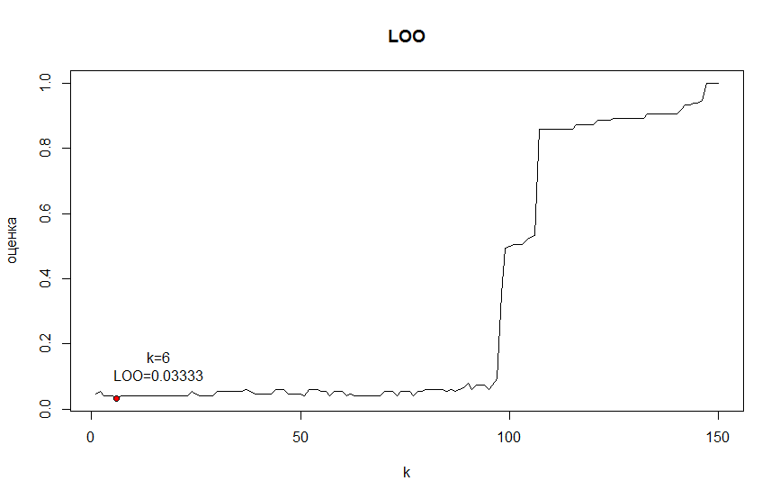|

<a href="#content">Вернуться к содержанию</a>

### <a name="kwNN"></a>Алгоритм классификации kwNN k-взвешенных соседей:
Недостаток kNN в том, что максимум может достигаться сразу на нескольких классах. В задачах с двумя классами этого можно избежать, если взять нечётное k. Более общая тактика, которая годится и для случая многих классов — ввести строго убывающую последовательность вещественных весов 
, задающих вклад i-го соседа в классификацию.  
Все объекты выборки сортируются по удаленности от классифицируемого объекта. Выбираются k ближайших соседей.
Классифицируемый объект относим к тому классу, суммарный вес которого больше.
В реализованном методе выбрана евклидова метрика.  
В качестве выборки был взят набор "Ирисы Фишера".  
В качестве последовательности весов взята нелинейно убывающую последовательность - геометрическая прогрессия: , где знаменатель прогрессии  является параметром алгоритма. Его можно подбирать по критерию LOO, аналогично числу соседей k. 

LOO(k) алгоритма kwNN|Карта классификации kwNN, при k = 6, q = 0.8
:------------------:|:--------------------------------:
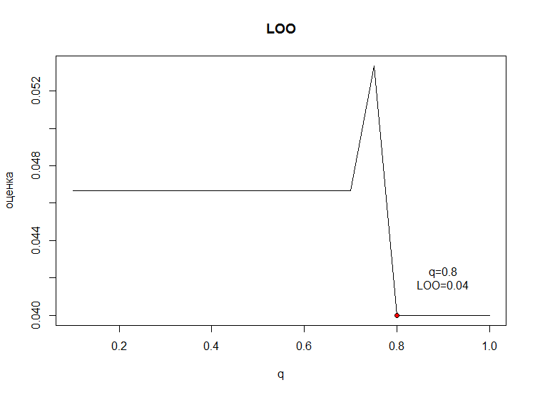|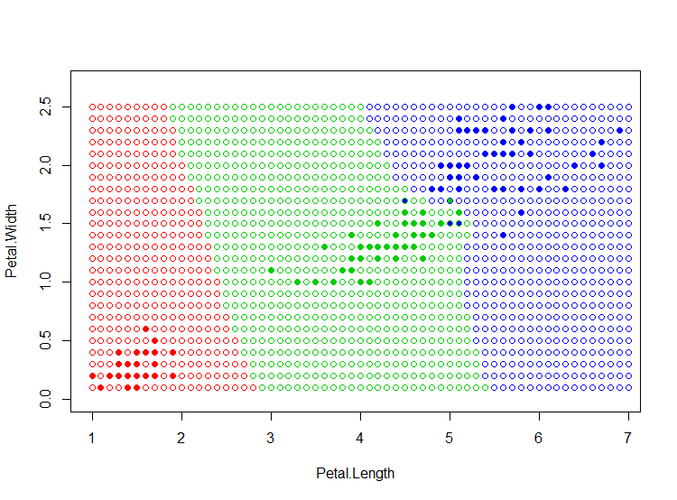

На следующем примере наглядно продемонстрированно превосходство алгоритма классификации kwNN над алгоритмом kNN:

|Сравнение kNN и kwNN|
|-------------------|
|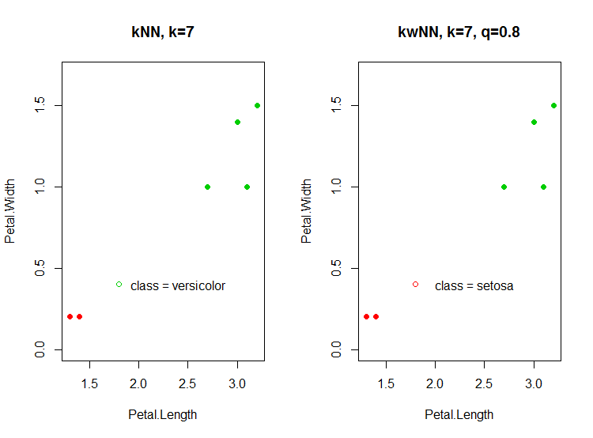|

Данный пример показывает преимущество алгоритма kwNN перед kNN, при k большем, чем размер выборки. В даном случае вес каждого элемента выборки играет значимую роль.

<a href="#content">Вернуться к содержанию</a>

### <a name="parsen"></a>Алгоритм классификации "Парзеновское окно":

В данном алгоритме весовая функция  определяется как функция от расстояния между классифицируемым объектом u и его соседями , а не от ранга соседа i, как было kwNN.

### Реализация на R
```R
#Parsen Windows
parsen <- function(dots, x, h=c(0.35), core=cG){
  dots <- sortDist(dots, x)
  
  class <- list()
  
  classes <- as.list(rep(0, 3))
  names(classes) = levels(dots$Species)
  
  for (i in seq(length(h))) {
    for (j in seq(length(dots[[1]]))) {
      yi <- dots[j,]
      classes[[yi$Species]] <- classes[[yi$Species]] + core(yi$Distance / h[i])
    }
    
    if(max(unlist(classes)) > 0) {
      class[i] <- names(sort(unlist(classes), decreasing = TRUE))[1]
    }
    else class[i] <- "unknown"
  }
  
  res <- unlist(class)
}
```
**Подберём оптимальное h, используя метод скользящего контроля, и построим карты классификации для всех ядер:**

|Прямоугольное ядро| Карта классификации и LOO
:------------------:|:--------------------------------:
|||

|Треугольное ядро| Карта классификации и LOO
:------------------:|:--------------------------------:
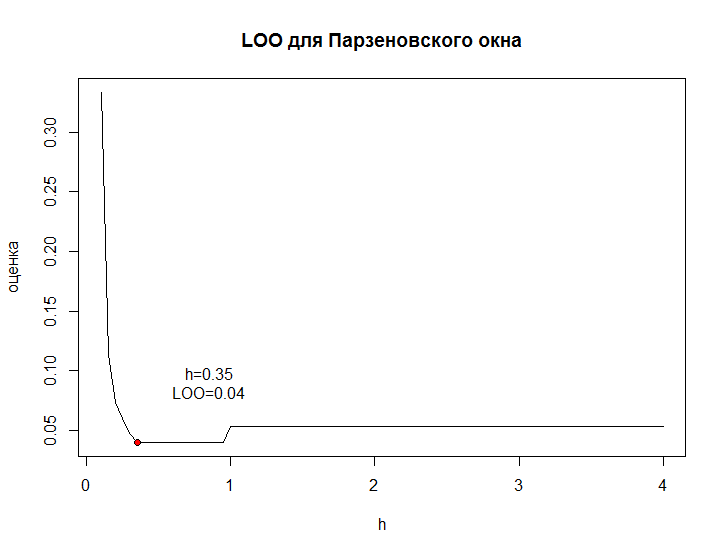|

|Квартическое ядро| Карта классификации и LOO
:------------------:|:--------------------------------:
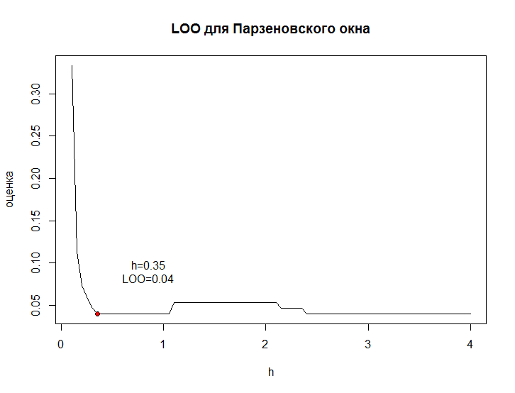|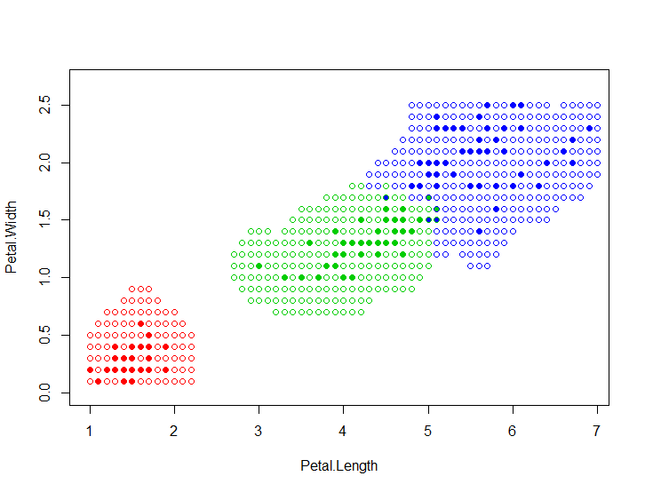

|Епанечниково ядро| Карта классификации и LOO
:------------------:|:--------------------------------:
|

|Гаусовское ядро| Карта классификации и LOO
:------------------:|:--------------------------------:
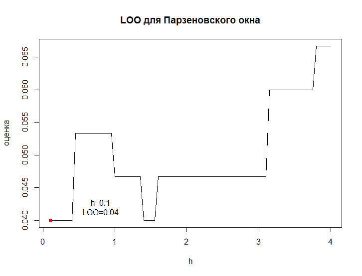|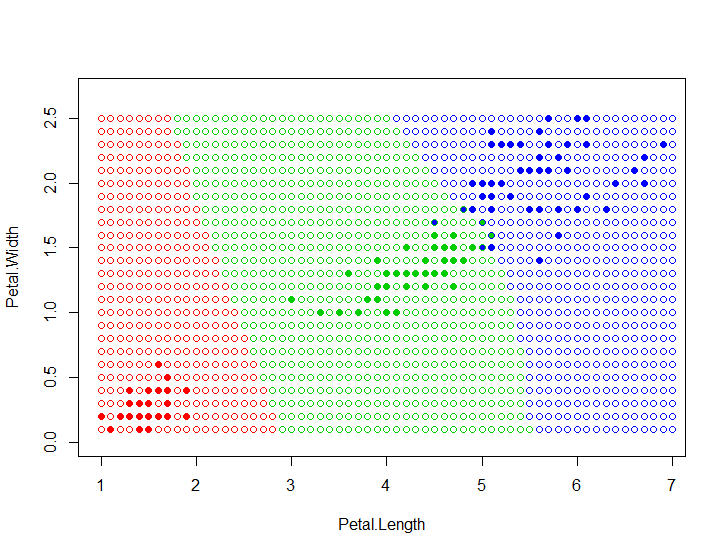

<a href="#content">Вернуться к содержанию</a>

###  <a name="potential"></a>Метод потенциальных функций

В реализуемом методе используется фиксированная ширина окна. Для первых 50 объектов (class=setosa) h=1, так как объекты данного класса достаточно удалены от объектов других. Для остальных объектов h=0.5.

Изачально потенциалы заполняются нулями. Далее, пока количество ошибок классификации не достигнет нужного предела, выбираем случайно точку x из выборки. Если для нее классификация выполняется неверно, увеличиваем потенциал на 1 и пересчитываем общее количество ошибок.

Ниже представленны карта потенциалов и карта классификации для Гаусовского ядра. Радиус круга - величина потенциала.

|Карта потенциалов| Карта классификации
:------------------:|:--------------------------------:
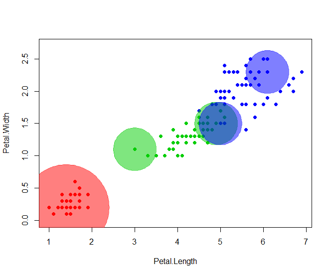|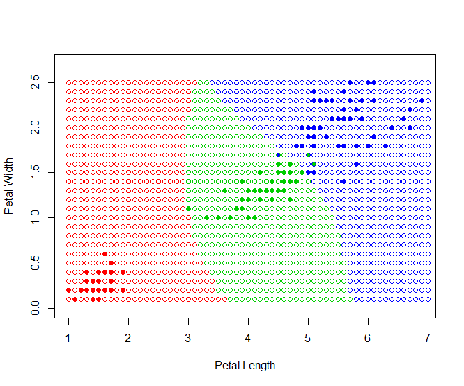

С помощью данного метода мы можем классифицировать объекты с максимальной возможной точностью, которую мы можем задать вручную при подборе параметров.

<a href="#content">Вернуться к содержанию</a>

## <a name="Bayes"></a>Байесовские классификаторы
### <a name="levels"></a>Линии уровня нормального распределения

N-мерным нормальным распределением будет называться распределение с плотностью 

с математическим ожиданием (μ) и матрицей ковариации (σ).

Релизация с помощью <a href="https://kompot-vjacovich.shinyapps.io/levels/">shiny</a>

### Реализация на R
```R
draw_lines <- function(mu, mtx, title) { #n-мерное гауссовское распределение
  a11 <- mtx[1,1]
  a12 <- mtx[1,2]
  a21 <- mtx[2,1]
  a22 <- mtx[2,2]
  
  det = det(mtx)
  
  A <- a11/det
  B <- a22/det
  C <- (-a12-a21)/det
  D <- (-2*a11*mu[1] + mu[2]*(a12+a21))/det
  E <- (-2*a22*mu[2] + mu[1]*(a12+a21))/det
  F <- (a11*mu[1]^2 + a22*mu[2]^2 - mu[1]*mu[2]*(a12+a21))/det
  
  N <- function(x,y) (1/(sqrt((2*pi)^2*det(mtx))))*exp((-1/2)*(x^2*A + y^2*B + x*y*C + x*D + y*E + F))
  
  x <- seq(-4, 4, 8/200)
  y <- seq(-4, 4, 8/200)
  z <- outer(x, y, N)
  
  par(pty="s")
  contour(x, y, z, main=title)
  
}
```

|Математическое ожидание μ  | Матрица ковариаций σ | Визуализация
:------------------:|:----------------------------:| :------------------:
(0,0)| matrix(1,0,0,1) |
(0,0)| matrix(2,1,1,2) |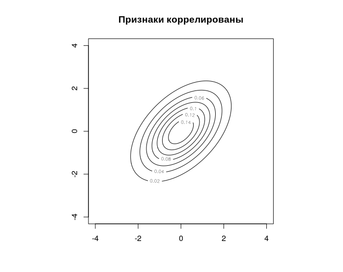
(0,0)| matrix(3,0,0,1) |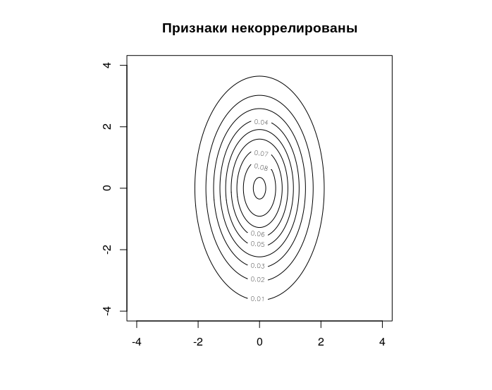
(0,0)| matrix(1,0,0,3) |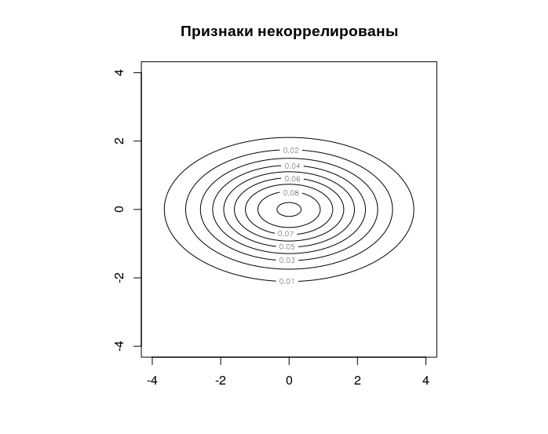

<a href="#content">Вернуться к содержанию</a>

### <a name="naive"></a>Наивный байесовский классификатор

<b>Наивный байесовский классификатор</b> – это алгоритм классификации, который принимает одно допущение: Каждый признак классифицируемых данных рассматривается независимо от других признаков класса. Метод называется наивным т.к. предполагается, что все признаки набора данных независимы, что встречается крайне редко.

Обычно он используется, как эталон при сравнении различных алгоритмов классификации.
Решающее правило принимает вид: 


Реализация на R
```R
calc_mu <- function(xl) sum(xl) / length(xl)

calc_sigma <- function(xl, mu) sum((xl-mu)^2)/(length(xl)-1)

naive_bayes <- function(xl, len1, len2, P, lyambda, mu, sigma) {
  p <- function(ksi, mu, sigma) (1/(sigma*sqrt(2*pi)))*exp(-(ksi-mu)^2 / (2*sigma^2))
  
  classification <- function(x, classes, mu, sigma, Py, lyambda) {
    classSum <- rep(0, length(classes))
    names(classSum) <- classes
    
    for (i in 1:length(classes)) {
      tmpSum <- 0
      
      for (j in 1:length(x)) {
        tmP <- p(x[j], mu[i,j], sigma[i,j])
        tmpSum <- tmpSum + log(tmP)
      }
      classSum[i] <- tmpSum + log(lyambda[i]*Py[i])
    }
    
    return(names(which.max(classSum)))
  }
  
  classify_all <- function(classes, mu, sigma, Py, lyambda) {
    classifiedObj <- c()
    
    for(i in seq(min(mu[, 1]) - 5, max(mu[, 1]) + 5, 0.1)) {
      for(j in seq(min(mu[, 2]) - 5, max(mu[, 2]) + 5, 0.1)) {
        classifiedObj <- rbind(classifiedObj, c(i, j, classification(c(i, j), classes, mu, sigma, Py, lyambda)))
      }
    }
    
    return(classifiedObj)
  }
  
  draw_plot <- function(xl, classifiedObj) {
    n <- ncol(xl)
    colors <- c("first"="red", "second"="green3")
    plot(xl[, 1:(n-1)], pch = 21, bg = colors[xl[,n]], col = colors[xl[,n]], 
         main = "Карта классификации нормального распределения", asp = 1)
    points(classifiedObj[, 1:(n-1)], pch = 21, col = colors[classifiedObj[, n]])
  }
  
  Py <- P
  len <- len1 + len2
  
  classes <- unique(xl[,ncol(xl)])
  
  classified <- classify_all(classes, mu, sigma, Py, lyambda)
  draw_plot(xl, classified)
}

```

Визуализация работы алгоритма при помощи <a href="https://kompot-vjacovich.shinyapps.io/naive/">shiny</a>

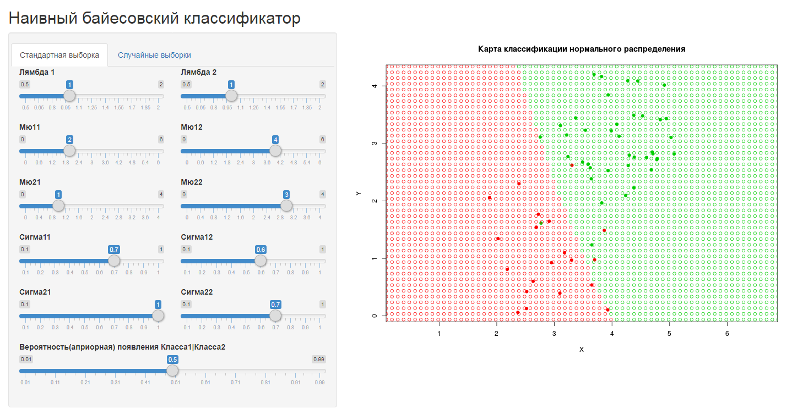

<a href="#content">Вернуться к содержанию</a>

### <a name="naive"></a>Plug-in

В качестве модели восстанавливаемой плотности в <b>Подстановочном алгоритме(Plug-in)</b> рассматривается многомерная нормальная плотность: 


где  -- математическое ожидание (центр), а  - ковариационная матрица 

Алгоритм заключается в восстановлении параметров нормального распределения ,  для каждого класса  и подстановке их в формулу оптимального байесовского классификатора. Предполагается, что ковариационные матрицы классов не равны.

Оценка параметров нормального распределения производится на основе *принципа максимума правдоподобия*:

 ,

.

Разделяющая поверхность между двумя классами *s* и *t* задаётся следующим образом:


Логарифмируя плотности каждого класса и подставив в выражение с разностью логарифмов, можем получть коэффициенты разделяющей кривой

Реализация на R
```R
calc_mu <- function(xl) sum(xl) / length(xl)

calc_sigma <- function(xl, mu) {
  sum <- 0
  for (i in 1:nrow(xl)) {
    xi <- matrix(c(xl[i,1], xl[i,2]), 1, 2)
    sum <- sum + t(xi - mu) %*% (xi - mu)
  }
  sum / (nrow(xl)-1)
}

plug_in <- function(xl, len1, len2, Py, mu, sigma, l1, l2) {
  
  discriminant <- function(mu, sigma, Py) {
    sigma1 <- sigma[1:2,]
    sigma2 <- sigma[3:4,]
    
    inverse_s1 <- solve(sigma1)
    inverse_s2 <- solve(sigma2)
    
    #xn = x^n
    x2 <- inverse_s1[1,1] - inverse_s2[1,1]
    y2 <- inverse_s1[2,2] - inverse_s2[2,2]
    xy <- 2 * inverse_s1[1,2] - 2 * inverse_s2[1,2]
    
    x1 <- 2 * inverse_s2[1,2] * mu[2,2] - 2 * inverse_s1[1,2] * mu[1,2] - 2 * inverse_s1[1,1] * mu[1,1] + 2 * inverse_s2[1,1] * mu[2,1]
    y1 <- 2 * inverse_s2[1,2] * mu[2,1] + 2 * inverse_s2[2,2] * mu[2,2] - 2 * inverse_s1[1,2] * mu[1,1] - 2 * inverse_s1[2,2] * mu[1,2]
    
    c <- -inverse_s2[1,1] * mu[2,1]^2 - 2 * inverse_s2[1,2] * mu[2,1] * mu[2,2] - inverse_s2[2,2] * mu[2,2]^2 + 
      inverse_s1[1,1] * mu[1,1]^2 + 2 * inverse_s1[1,2] * mu[1,1] * mu[1,2] + inverse_s1[2,2] * mu[1,2]^2 + 
      log(det(sigma1)) - log(det(sigma2)) - Py[1]/Py[2]
    
    func <- function(x, y) {
      x^2*x2 + y^2*y2 + x*y*xy + x*x1 + y*y1 + c
    }
    
    return(func)
  }
  
  getLyambda <- function(l1, l2, P1, P2) {
    log((l1*P1)/(l2*P2))
  }
  
  draw_plot <- function(xl, mu, sigma, Py, l1, l2) {
    x <- seq(min(mu[,1]) - 5, max(mu[,1]) + 5, length.out = 100)
    y <- seq(min(mu[, 2]) - 5, max(mu[, 2]) + 5, length.out = 100)
    
    func <- discriminant(mu, sigma, Py)
    z <- outer(x, y, func)
    
    lyambda <- getLyambda(l1, l2, Py[1], Py[2])
    
    n <- ncol(xl)
    colors <- c("first"="red", "second"="green3")
    plot(xl[, 1:(n-1)], pch = 21, bg = colors[xl[,n]], col = colors[xl[,n]], 
         main = "Карта классификации нормального распределения", asp = 1)
    contour(x, y, z, lwd = 3, levels = lyambda, col = "black", drawlabels = F, add = T)
  }
  
  len <- len1 + len2
  
  classes <- unique(xl[,ncol(xl)])
  
  draw_plot(xl, mu, sigma, Py, l1, l2)
}

```

Визуализация работы алгоритма при помощи <a href="https://kompot-vjacovich.shinyapps.io/Plug-in/">shiny</a>


<a href="#content">Вернуться к содержанию</a>
