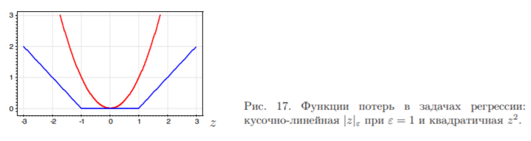
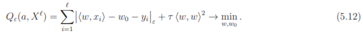

# Метод опорных векторов в задачах регрессии

В главе 5 мы уже рассматривали задачи многомерной линейной регрессии,
предполагая, что $X = R^n, Y = R$, алгоритм имеет вид $a(x) = ⟨w, x⟩ − w_0$, и для
настройки параметров $w ∈ R_n$ и $w_0 ∈ R$ минимизируется квадратичный функционал.

Однако в некоторых случаях более естественно использовать кусочно-линейную
функцию $ε$-чувствительности, показанную на Рис 17: $|z|_ε = (|z| − ε)_+$, которая
не считает за ошибки отклонения $a(x_i)$ от $y_i$, меньшие $ε$. Предполагается, что значение параметра ε задаёт эксперт, исходя из априорных соображений.
С этой функцией потерь функционал принимает вид

Все объекты $x_i, i = 1,..., ℓ$ делятся на следующие пять типов:
1. $|a(x_i) − y_i| < ε; λ^+_i = λ^−_i = ξ^+_i = ξ^−_i = 0.$
Ответ алгоритма $a(x_i)$ находится внутри отрезка $[y_i − ε, y_i + ε]$ и считается
верным. Объект $x_i$ не является опорным — вектор весов $w$ не изменился бы, если бы
этого объекта изначально не было в выборке.
2. $a(x_i) = y_i + ε; 0 < λ^+_i < C; λ^−_i = 0; ξ^+_i = ξ^−_i = 0.$
3. $a(x_i) = y_i − ε; 0 < λ^−_i < C; λ^+_i = 0; ξ^+_i = ξ^−_
i = 0.$
4. $a(x_i) > y_i + ε; λ^+_i = C; λ^−_i = 0; ξ^+_i = a(x_i) − y_i − ε > 0; ξ^−_i = 0.$
5. $a(x_i) < y_i − ε; λ^−_i = C; λ^+_i = 0; ξ^−_i = y_i − a(x_i) − ε > 0; ξ^+_i = 0.$
Объекты типов 2–5 являются опорными и учитываются при определении вектора весов. При этом только на объектах типов 4 и 5 возникает ненулевая ошибка.