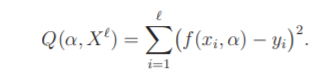
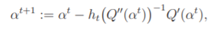
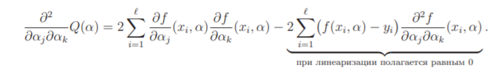
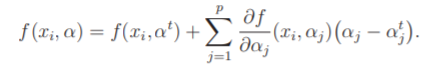
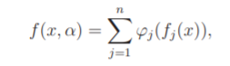
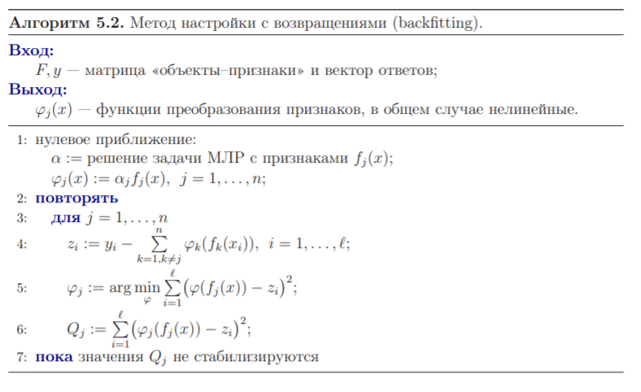
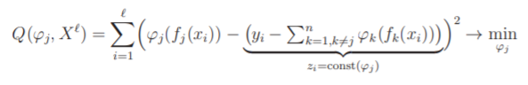
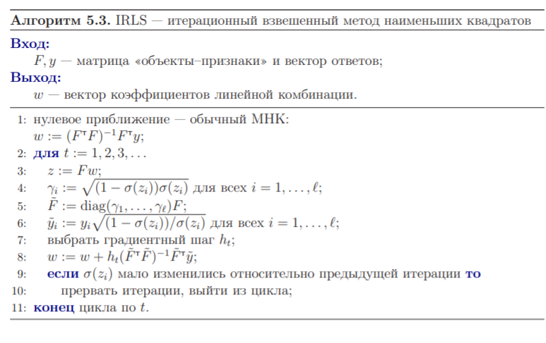

# Нелинейные методы восстановления регрессии

Предположение о том, что модель регрессии линейна по параметрам, удобно для построения численных методов, но не всегда хорошо согласуется со знаниями о предметной области. Общая идея во всех этих случаях одна: нелинейная задача сводится к решению
последовательности более простых линейных задач.

## Нелинейнвя модель регрессии

Пусть задана нелинейная модель регрессии $f(x, α)$ и требуется минимизировать
функционал качества по вектору параметров $α ∈ R_p$:

Для выполнения численной минимизации функционала $Q$ воспользуемся методом Ньютона–Рафсона. Выберем начальное приближение $α_0 = (α^0_1,..., α^0_p)$ и организуем итерационный процесс

где $Q^\prime
(α^t
)$ — градиент функционала $Q$ в точке $α^t
, Q^{\prime\prime}(α^t
)$ — гессиан (матрица вторых производных) функционала $Q$ в точке $α^t
,\ h^t$ — величина шага, который можно
регулировать, а в простейшем варианте просто полагать равным единице.
Запишем компоненты градиента:

Более эффективной с вычислительной точки зрения является следующая модификация этого метода. Если функция $f$ достаточно гладкая (дважды непрерывно
дифференцируема), то её можно линеаризовать в окрестности текущего значения
вектора коэффициентов $α^t$:

## Нелинейные одномерные преобразования признаков

На практике встречаются ситуации, когда линейная модель регрессии представляется необоснованной, но предложить адекватную нелинейную модель $f(x, α)$ также не удаётся. Тогда в качестве компромисса строится модель вида

где $ϕ_j : R → R$ — некоторые преобразования исходных признаков, в общем случае
нелинейные. Задача состоит в том, чтобы подобрать неизвестные одномерные преобразования $ϕ_j$ , при которых достигается минимум квадратичного функционала (5.1).

### Метод настройки с возвращением

Метод основан на итерационном уточнении функций $ϕ_j$ . На первом шаге они
полагаются линейными, $ϕ_j (x) = α_jf_j(x)$, и неизвестные коэффициенты $α_j$ настраиваются методами многомерной линейной регрессии. На каждом последующем шаге
выбирается одна из функций $ϕ_j$ , все остальные фиксируются, и выбранная функция
строится заново. Для этого решается стандартная задача наименьших квадратов

с обучающей выборкой $Z^ℓ_j = (f_j(x_i), z_i)^ℓ_{i=1}$. Для решения данной задачи годятся любые одномерные методы: ядерное сглаживание, сплайны, полиномиальная или Фурье-аппроксимация.

## Логистическая регрессия и итерационный взвешенный МНК

